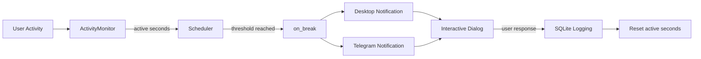

👁️ 20‑20‑20 Eye Care Tool
A context‑aware, intelligent eye‑care assistant that actually respects your time.

Stop using dumb interval timers. This tool tracks active screen time, pauses when you step away, and reminds you to rest your eyes – only when you’re actually working.

🧠 Why This Tool Exists
Digital eye strain (Computer Vision Syndrome) affects millions who spend long hours in front of screens. The 20‑20‑20 rule – every 20 minutes, look at something 20 feet away for 20 seconds – is the most effective proven mitigation.

But every existing “20‑20‑20 app” is a dumb timer that fires every 20 minutes regardless of whether you’re at the desk, idle, or away. They have near‑zero real‑world utility.

This tool is different.

✨ What Makes This Tool Smart
Feature	Typical Timer App	This Tool
Trigger logic	Fixed wall‑clock	Active‑time based (pauses on idle)
Fatigue awareness	None	Optional webcam (Phase 3)
Language support	English only	Tamil + English (extensible)
Reach	Desktop popup only	Desktop + Telegram push
User response	None	Dismiss / Snooze captured
Data logging	None	SQLite session/break history
Reporting	None	Weekly/monthly trends (Phase 4)
Architecture	Monolithic script	Modular package – importable
🚀 Features (Phase 1 & 2)
✅ Phase 1 – Core MVP
Activity Monitor – Tracks keyboard/mouse input via pynput (Windows fallback uses GetLastInputInfo for reliability).

Idle Pause – The timer only advances when you are actively using the computer. Step away for a coffee – the timer waits for you.

Desktop Notifications – Cross‑platform popups via plyer, with Tamil and English locale support.

SQLite Logging – Every session and break is logged, including user_response (taken / snoozed).

Configurable – All settings are in config.json; no need to touch the source code.

✅ Phase 2 – Remote Reach & Interaction
Telegram Notifications – Get a push message on your phone even if you’re away from the PC (requires bot token).

Interactive GUI Dialog – A clean modal window with Dismiss and Snooze (1 min) buttons. No more console prompts.

Snooze Handling – If you’re in the middle of something, snooze for 60 seconds – the timer pauses and resumes after that.

Automation Ready – Runs silently in the background (pythonw.exe) and can start automatically on system boot.

Extended Config – Locale, notification channels, Telegram credentials, intervals, and more are all in config.json.
## 📦 Architecture

```
eye_care_tool/
├── core/
│   ├── activity_monitor.py   # Tracks input & accumulates active seconds
│   ├── scheduler.py          # State machine, snooze logic
│   └── config.py             # Dataclass + JSON loader
├── notify/
│   ├── desktop_notifier.py   # plyer wrapper
│   ├── telegram_notifier.py  # Telegram Bot API
│   └── locales/
│       ├── en.json
│       └── ta.json
├── storage/
│   ├── db.py                 # SQLite connection & schema
│   └── models.py             # Dataclasses
├── tests/
│   └── test_activity_monitor.py
├── main.py                   # Tkinter‑driven entry point
├── config.json               # User settings (overrides defaults)
├── requirements.txt
└── README.md
```
### Data Flow



🛠️ Installation & Setup
1. Clone the repository
bash
git clone https://github.com/ajeemsuban060-glitch/eye-care-tool.git
cd eye-care-tool
2. Install dependencies
bash
pip install -r requirements.txt
(Requires Python 3.8+)

3. Configure the tool
Edit config.json to your liking. Example:

json
{
    "idle_threshold_seconds": 10,
    "active_interval_seconds": 1200,
    "locale": "ta",
    "notification_channels": ["desktop", "telegram"],
    "telegram_bot_token": "YOUR_BOT_TOKEN",
    "telegram_chat_id": 123456789,
    "db_path": "eye_care.sqlite",
    "snooze_duration_seconds": 60,
    "fallback_to_console": false
}
active_interval_seconds – How many active seconds before a break (1200 = 20 min).

locale – "ta" for Tamil, "en" for English.

notification_channels – ["desktop"] / ["desktop", "telegram"].

Telegram – Leave empty if you don’t want it.

fallback_to_console – Set false for silent GUI mode; true will show a console prompt instead of the GUI (useful for debugging).

4. Run the tool
Normal mode (with console window – debugging):

bash
python main.py
Silent background mode (production):

bash
pythonw main.py
🤖 Automation (Start on Boot)
Press Win + R, type shell:startup, press Enter.

Create a new shortcut with:

Target: "C:\Path\To\pythonw.exe" "D:\Path\to\eye-care-tool\main.py"

Start in: D:\Path\to\eye-care-tool

Name it EyeCareTool.

Now it will start automatically when you log in.


## 📚 Scientific Research & Evidence

The 20-20-20 rule is widely recommended for reducing digital eye strain (Computer Vision Syndrome). But what does the actual science say?

### 🏛️ Major Health Organization Endorsements

Leading health authorities globally recommend the 20-20-20 rule:

- **American Academy of Ophthalmology (AAO)** – Recommends the rule as a simple practice to reduce eye fatigue.
- **Centers for Disease Control and Prevention (CDC)** – Suggests trying the rule to reduce eye strain.
- **MedlinePlus (U.S. National Library of Medicine)** – Lists the rule as a practical strategy for eye health.

This widespread endorsement by trusted institutions provides a strong foundation for the rule.

### 📊 Clinical Studies Supporting the Rule

Several recent studies have evaluated the rule's effectiveness:

| Study | Findings |
|-------|----------|
| **2025 Prospective Study** *(Indian Journal of Clinical and Experimental Ophthalmology, n=268)* | **59% of participants reported symptom relief** (tired eyes, headaches) after 4 weeks of following the rule. |
| **2023 Randomized Controlled Trial** *(Journal of Optometry, n=29)* | The rule is an **effective strategy for reducing digital eye strain and dry eye symptoms**. |
| **2025 Systematic Review** | Concluded that the rule is **effective in overcoming Computer Vision Syndrome (CVS)** in workers. |

### 🧐 Critical Perspectives & Conflicting Evidence

While positive findings exist, some research presents a more nuanced view:

- **2022 Systematic Review** *(included 45 clinical trials)* – Found **"very low certainty evidence"** for the rule. Only one study specifically evaluated it, indicating a lack of robust, high-quality research.
- **2024 Conference Presentation** – Described the rule's clinical impact as **"marginal"** , offering only **"brief symptomatic relief"** .
- **2026 Commentary** *(Journal "Eye")* – Stated that the rule **"has been found to be ineffective for treating digital eye strain"** .
- **2023 Survey Study** *(n=432)* – Found that **only 34% of participants practiced the rule** at least occasionally, highlighting a gap between recommendation and real-world adherence.

### 📝 Balanced Summary

| Aspect | Takeaway |
|--------|----------|
| ✅ **Safe** | No side effects – it's free and simple to implement. |
| ✅ **Recommended** | Endorsed by AAO, CDC, and other major health bodies. |
| ✅ **Some Relief** | Multiple studies show symptom improvement for many users. |
| ⚠️ **Modest Evidence** | High-quality, large-scale trials are limited. |
| ⚠️ **Not a Cure** | May not work for everyone; should be part of a broader eye-care routine. |

**Bottom line:** The 20-20-20 rule is a **safe, free, and simple habit** that may help reduce eye strain for many people. It encourages taking regular breaks from screens – which is universally beneficial – and is recommended by leading health organizations. Think of it as a helpful tool, not a guaranteed cure.

*This tool automates the rule so you don't have to remember it – letting you focus on your work while taking care of your eyes.* 👁️


📊 Logging & Analytics
The tool stores every session and break in eye_care.sqlite (SQLite). You can query the data for personal analytics. Example query to see the last break:

bash
python -c "import sqlite3; conn=sqlite3.connect('eye_care.sqlite'); cur=conn.cursor(); cur.execute('SELECT * FROM breaks ORDER BY id DESC LIMIT 1'); print(cur.fetchone()); conn.close()"
🧪 Testing
Run unit tests with:

bash
python -m unittest discover tests
🌐 Future Phases (Planned)
Phase 3 – Fatigue Intelligence – Experimental webcam‑based Eye Aspect Ratio (EAR) detection using MediaPipe.

Phase 4 – Analytics Dashboard – FastAPI + Jinja2 to visualise weekly strain trends.

❤️ Contributing
Pull requests are welcome. For major changes, please open an issue first to discuss what you would like to change.

📝 License
MIT – see LICENSE file for details.

🙏 Acknowledgements
plyer for cross‑platform notifications.

pynput (initial) and Windows GetLastInputInfo for activity tracking.

Telegram Bot API for remote notifications.

👨‍💻 Author
Ajeem Suban – GitHub

Take care of your eyes – they’re the only pair you’ve got. 👁️💙

